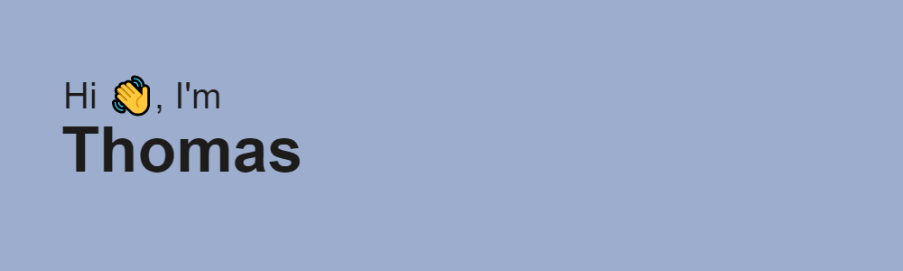

I'm a Software Developer from Ontario, Canada.

### About Me:

- 🔭 I'm a Code Breaker at EnPowered, helping to decrypt utility bills in Ontraio, New York, and Ohio.
- ⚡ In my free time, I like learning about new subjects such as Cryptography, Web Development, and Business.
- 🌱 Exploring the world of Software Development and Entreprenuership and the like.
- ⚡ Fun fact: I named myself Thomas when I was 7 while I watching Thomas the Train.
- 🤔 I’m currently looking for Fall 2022 Internships.

### Languages and Tools :

  &nbsp;
  &nbsp;
  &nbsp;
  &nbsp;
  &nbsp;
  &nbsp;
  &nbsp;
  &nbsp;
  &nbsp;
  &nbsp;
  
  

### My Stats :

